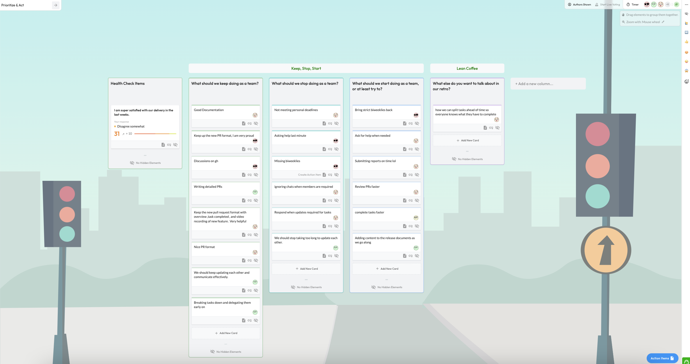

# **Meeting:** Sprint Retrospective

**Date:** 2025-03-02
**Time:** 17h00 - 17h45
**Purpose:** Sprint Retrospective Review
**Attendees:** Minh, Melissa, Edward, Hudson, Edward, Allaye, Asif, Safaa, Ayesha
**Absent:** 

## Agenda Items

### **1. Sprint Review**

### **2. Discussion Points**

#### **What Went Well**
- New Format of documenting pull Request (Overview,key changes, Testing,Todo etc)
- Documentation quality has improved.
- Retrospective meetings had higher attendance.

#### **What Could Be Improved**
- Meeting personal deadlines more consistently.
- Asking for help earlier instead of waiting until the last minute.
- Responding promptly when updates are required for tasks.

#### **Action Items**
- Implement stricter meeting attendance policy
- Require attendance at a minimum of one meeting per week if unable to attend others.
- Review and adjust sprint workload distribution
- Set up additional check-ins for timeline tracking
- Reinstate strict biweekly check-ins.

### **3. Next Sprint Planning**

#### **Priority Items**
- Complete remaining accessibility issues
- Begin work on MVP1 features
- Update technical documentation

### **4. Action Items/To-Do**
- Team leads to review sprint assignments
- Prepare for Presentation