# Guide to System Diagrams

# Guide to System Diagrams

## Overview

System diagrams are now maintained externally as separate .puml files under the "plantuml/src" folder.
A new processing system is in place:
1. Edit the individual .puml files (e.g., plantuml/src/use-case-diagram.puml).
2. Run the script:
   ```bash
   ./generate-diagrams.sh
   ```
   This will generate the corresponding PNG images in plantuml/img/.
3. The markdown files (e.g., System-Diagrams.md) reference these generated images using the path plantuml/img/{diagram-name}.png.

## Design Philosophy

### MVVM Architecture

- Use interfaces to define clear contracts between layers
- Keep models technology-agnostic (no framework-specific types)
- Avoid exposing implementation details in interfaces
- ViewModels handle state management and business logic
- Models represent pure domain concepts

### Database Design

- Avoid embedding foreign keys in entities - use relationships instead
- Prefer association classes over complex relationships
- Design for reusability - extract common patterns into base classes/interfaces
- Use inheritance and composition to model "is-a" and "has-a" relationships
- Keep entities focused and cohesive - split large entities when appropriate

### Best Practices

- Follow Single Responsibility Principle
- Make relationships explicit through association classes
- Use enums for fixed value sets
- Document constraints and business rules
- Design for extensibility

## PlantUML Guide

### Basic Elements

#### Class Notation

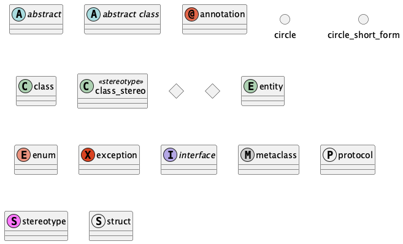

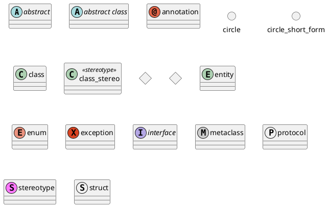

#### Relationships

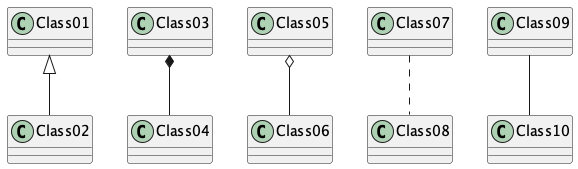

| Type           | Symbol | Purpose                                       |
|----------------|--------|-----------------------------------------------|
| Extension      | <\|--  | Specialization of a class in hierarchy        |
| Implementation | <\|..  | Realization of an interface by a class        |
| Composition    | *--    | Part cannot exist without the whole           |
| Aggregation    | o--    | Part can exist independently of the whole     |
| Dependency     | -->    | Object uses another object                    |
| Dependency     | ..>    | Weaker form of dependency                     |

Replace -- with .. for dotted lines.

#### Examples


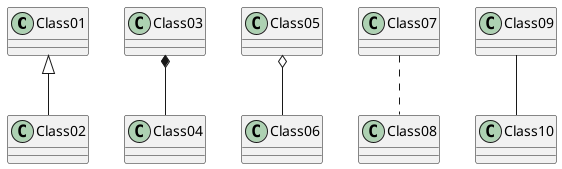

#### Association Classes

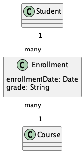

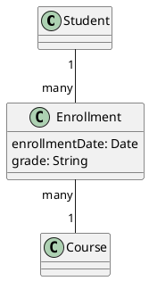

### Styling

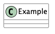

#### Skinparam Settings

Use skinparam to control diagram appearance:

```plantuml
@startuml
skinparam class {
    BackgroundColor White
    ArrowColor Black
    BorderColor Black
}
skinparam stereotypeCBackgroundColor Yellow
skinparam stereotypeCBorderColor Brown

class Example
@enduml
```

Common skinparam options:
- `BackgroundColor`
- `BorderColor`
- `ArrowColor`
- `FontName`
- `FontSize`
- `Shadowing`

### Advanced Features

#### Labels and Cardinality

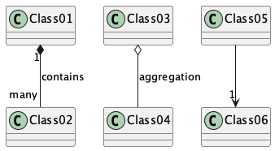

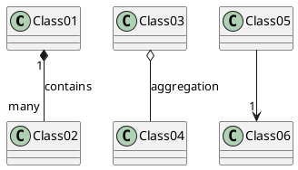

#### Visibility Modifiers

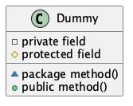

- `-` private
- `#` protected
- `~` package private
- `+` public

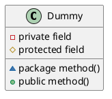

#### Notes

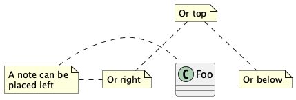

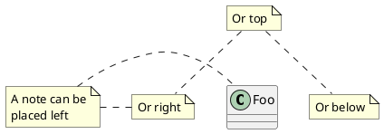

#### Stereotypes

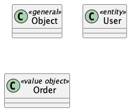

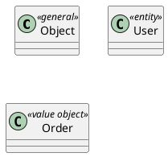

### Layout Tips

#### Direction

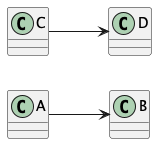

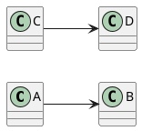

#### Grouping

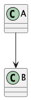

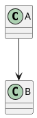

#### Hidden Links

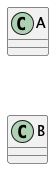

Use [hidden] to force layout without showing relationship:

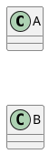

## Use Case Diagrams

### Complete Example

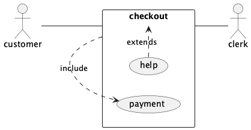

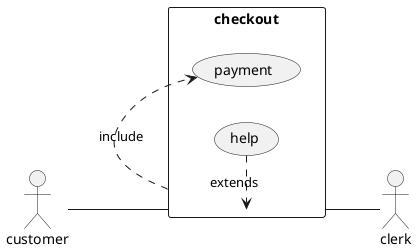

This example demonstrates key concepts in use case diagrams:

1. **Direction**: `left to right direction` makes the diagram read horizontally
2. **Style**: `skinparam packageStyle rectangle` sets visual style
3. **Actors**: External users (`customer` and `clerk`)
4. **System Boundary**: `rectangle checkout { }` groups related use cases
5. **Relationships**:
   - Solid line (`--`): Basic association between actor and use case
   - Dotted arrow with open head (`.>`): Include or extend relationship
   - Labels: `: include` and `: extends` specify relationship type

### Basic Elements

#### Actors

Actors can be defined using:
- `:Actor Name:` syntax
- `actor` keyword
- Optional alias with `as` keyword

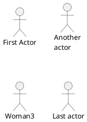

#### Use Cases

Use cases can be defined using:
- Parentheses `(Use Case Name)`
- `usecase` keyword
- Optional alias with `as` keyword

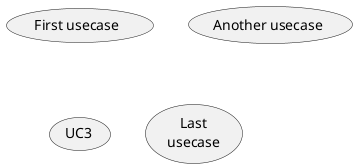

### Relationships

- Basic association: `->`
- Include relationship: `..>`
- Extend relationship: `<..`
- Generalization: `--|>`

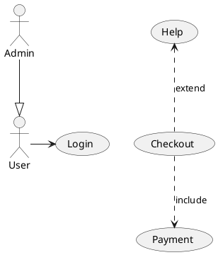

### Packages

Group related elements using packages:

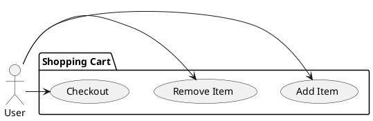

### Notes and Comments

Add explanatory notes:

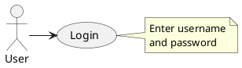

### Best Practices

1. Keep diagrams focused and simple
2. Use meaningful names for actors and use cases
3. Group related elements in packages
4. Add notes to clarify complex interactions
5. Use consistent naming conventions:
   - Actors only connect to main use cases (manage/view/get)
   - Use includes/extends for sub-functionality
   - Accessibility features should extend both indoor/outdoor navigation
6. Maintain proper spacing and layout
7. Include only relevant relationships
8. Document assumptions and constraints
