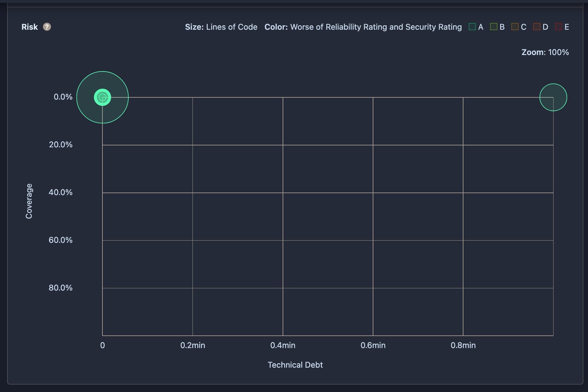

# Refactoring History

This document tracks significant code restructuring and pattern implementations in the project.

## Major Refactorings

| Pull Request                                          | Sprint | Pattern/Type                  | Motivation                                              | Before Metrics | After Metrics                                    | Structure Changes                                                                                                                                         |
| ----------------------------------------------------- | ------ | ----------------------------- | ------------------------------------------------------- | -------------- | ------------------------------------------------ | --------------------------------------------------------------------------------------------------------------------------------------------------------- |
| [PR #119](https://github.com/vibqetowi/Minicap/pull/119) | 2      | MVVM Migration                | Better separation of concerns, improved maintainability | Not measured   |  | • Separated UI logic from business logic ` `• Created ViewModels for each view ` `• Established data binding ` `• Isolated Model layer |
| [PR #163](https://github.com/vibqetowi/Minicap/pull/163) | 3      | Initial Gluestack Refactoring | For reusability of styles                               | Not measured   |           | • Refactored all inline css to reusable styles Ensuring compliance of reusable styles will be up to UI team                                         |

*Note for future refactorings: Always capture before/after metrics using SonarCloud analysis*
