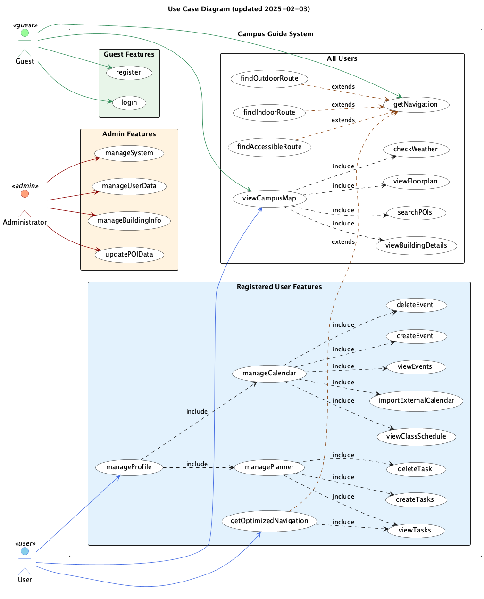
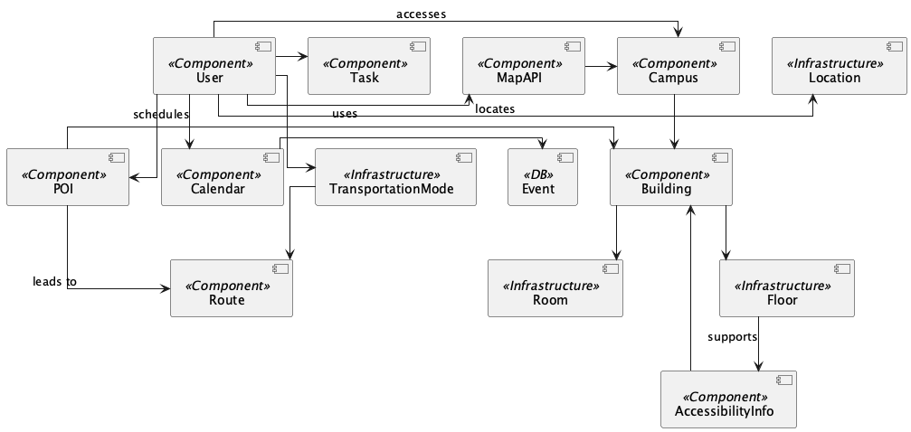
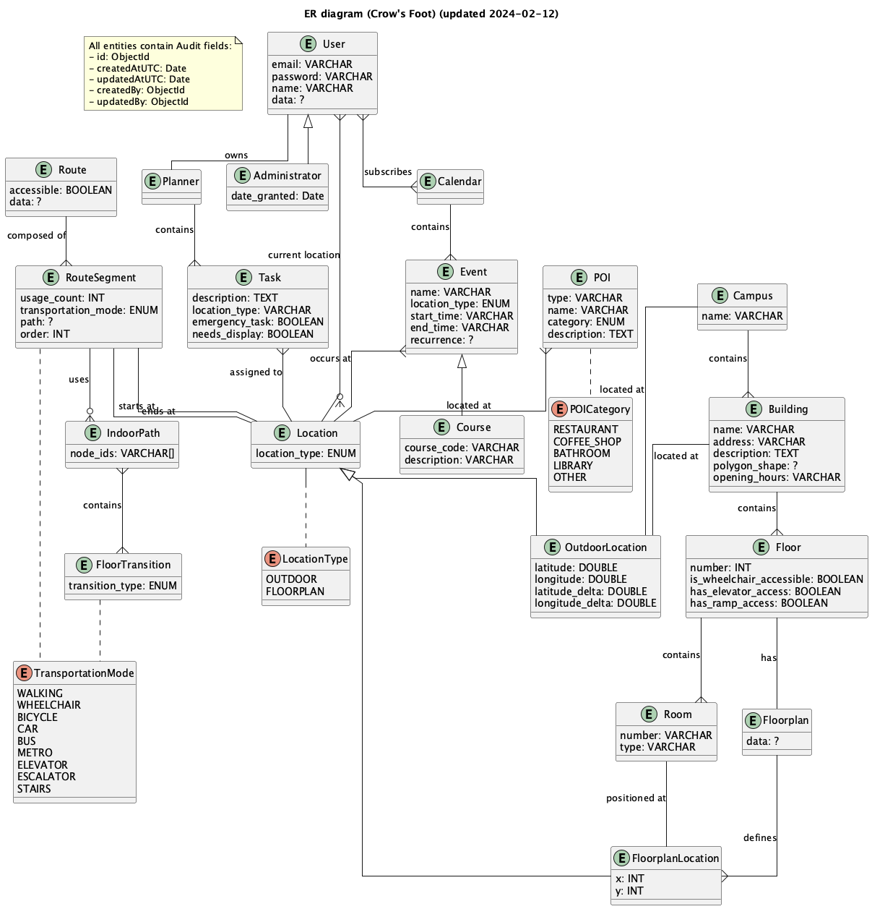
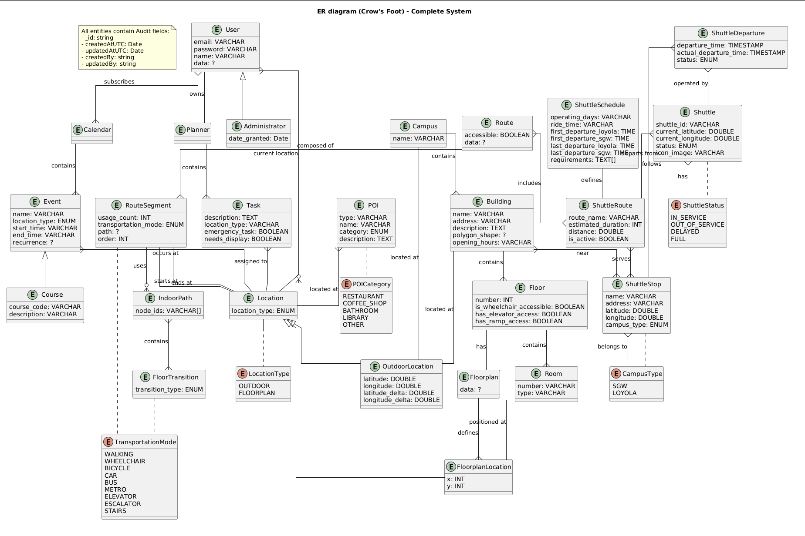
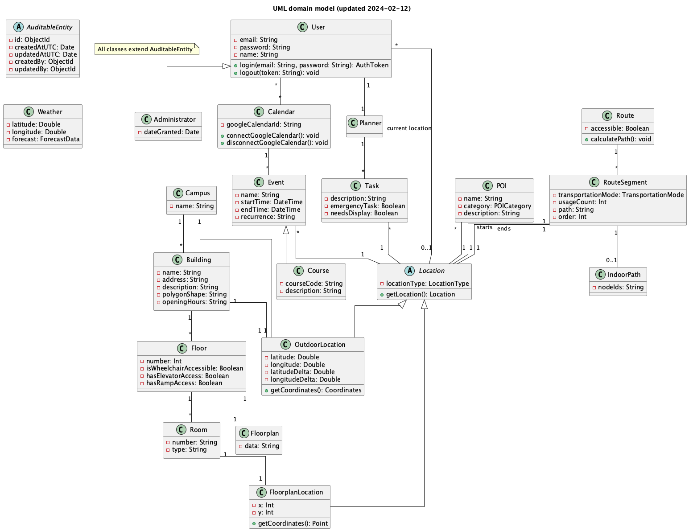

# System Diagrams

## Use Case Diagram

## Component Diagram

## Entity Relationship Diagram (ERD)

### Original ERD

### Complete System ERD (with Shuttle Integration)

This updated ERD includes all system entities and their relationships, including the shuttle bus integration feature. Key additions include:
- Shuttle-related entities (ShuttleSchedule, ShuttleStop, Shuttle, ShuttleDeparture, ShuttleRoute)
- New enums (ShuttleStatus, CampusType)
- Integration with existing entities (Building, Route, Location)
- Complete relationship mapping between shuttle and core system components

## Domain Model

