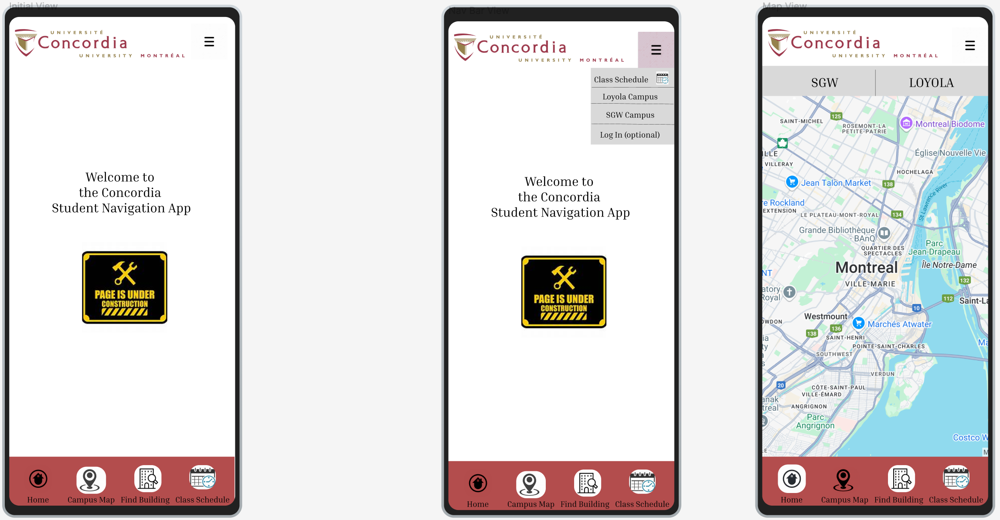
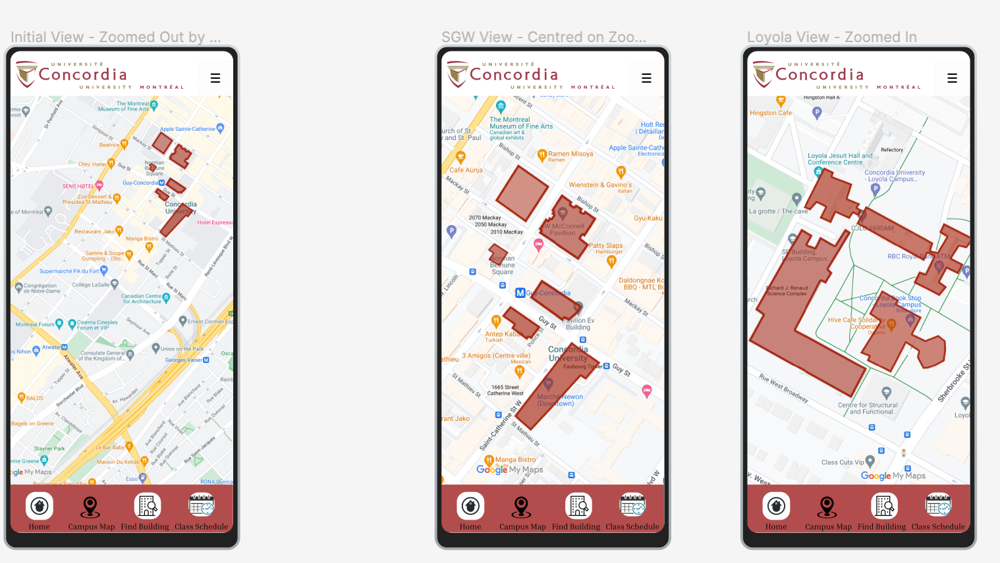
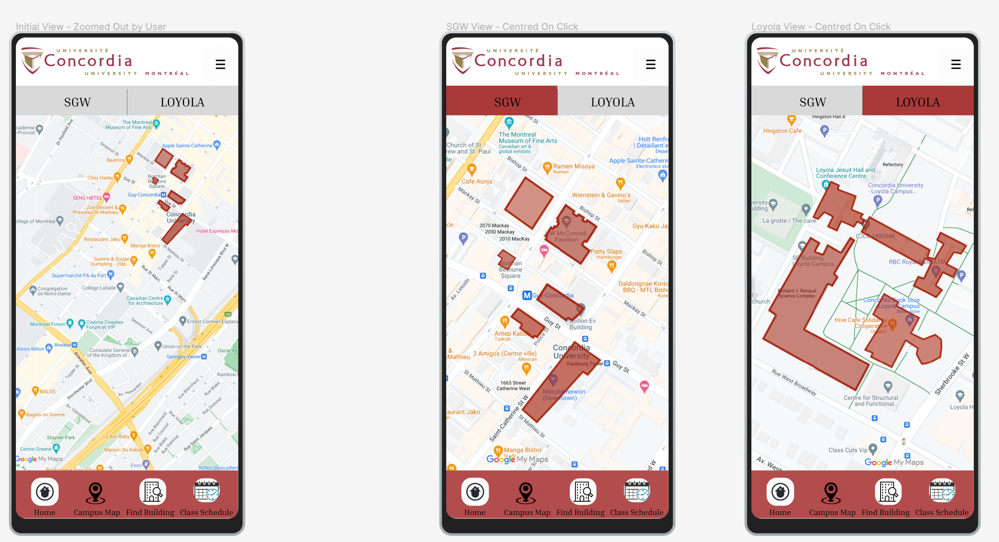
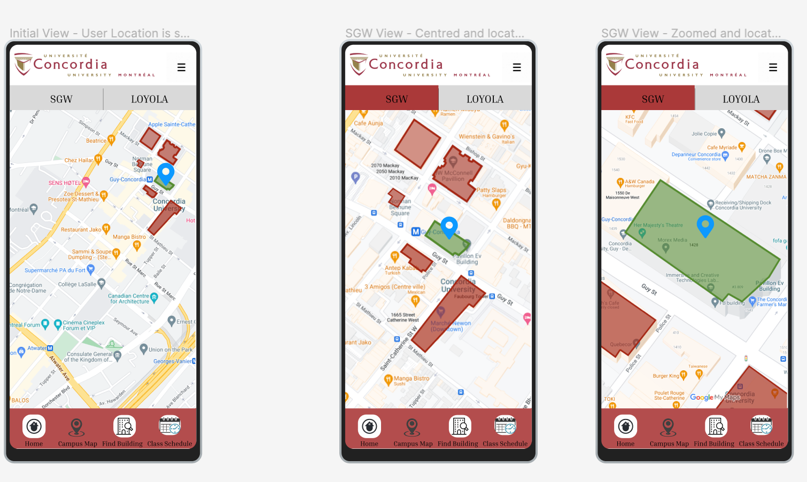
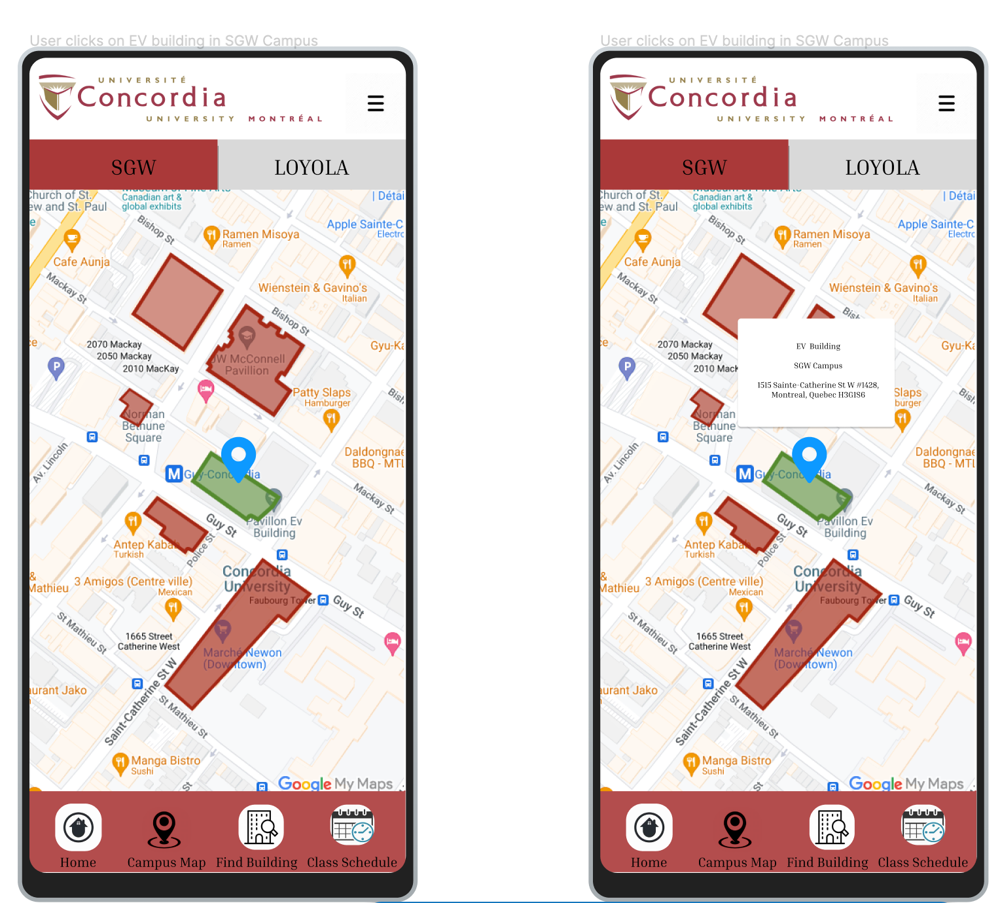

# UI-UX Documentation

**Table of Contents**
* [Personas](#personas)
  * [Persona 1: Sarah, The Freshman](#persona-1-sarah-the-freshman)
  * [Persona 2: James, The Busy Graduate Student](#persona-2-james-the-busy-graduate-student)
  * [Persona 3: Amina, The Accessibility Advocate](#persona-3-amina-the-accessibility-advocate)
    * [Persona 4: Raj, The Tech-Savvy Commuter](#persona-4-raj-the-tech-savvy-commuter)
    * [Persona 5: Elena, The Stressed Student](#persona-5-elena-the-stressed-student)
* [Wireframes](#wireframes)
  * [Archived Wireframes](#archived-wireframes)

---

## Personas 

### Persona 1: Sarah, The Freshman 

**Description:** Sarah, 18, is a brand new freshman at Concordia, feeling the typical first-year overwhelm.  The SGW and Loyola campuses feel huge and confusing to her.  Staying on schedule and finding her way are her biggest challenges right now.

**Goals:**

*   Effortlessly navigate both SGW and Loyola campuses.
*   Quickly locate classrooms, libraries, and casual spots like coffee shops or study areas.
*   Gain confidence in navigating unfamiliar university spaces using the app.

**Frustrations:**

*   Constantly getting lost, leading to lateness and anxiety.
*   Difficulty managing time between classes due to navigation uncertainty.
*   The sheer size of the campus is intimidating and disorienting.

**Accessibility Needs:**

*   Simple, visually clear UI.  Intuitive map interface with easily identifiable labels and pop-up information for buildings.

**Tasks Sarah Will Perform:**

*   Use indoor/outdoor maps to find classrooms and key locations.
*   Smoothly switch between SGW and Loyola campus views.
*   Search for nearby coffee shops or relaxation spots between classes.

**Impact on Design:**

*   **Prioritize Intuitive Navigation:** Design must be extremely easy to learn and use, even for first-time users.
*   **Visual Clarity:** Clear map markers, distinct building labels, and a simple visual hierarchy are crucial.
*   **Prominent Search & Toggle:**  Search functionality and the campus toggle should be easily discoverable and used.

### Persona 2: James, The Busy Graduate Student 

**Description:** James, 27, is a time-crunched graduate student juggling research, teaching, and life. He's constantly moving between buildings and needs tools that are efficient and fast.  His mild colorblindness makes poorly designed interfaces a real obstacle.

**Goals:**

*   Swiftly navigate between campus buildings, especially when time is tight.
*   Minimize transit time and avoid bad weather exposure where possible.
*   Efficiently combine campus errands into single trips (e.g., library, coffee, meetings).

**Frustrations:**

*   Wasted time getting lost or taking inefficient routes between locations.
*   Campus apps that are visually confusing due to low contrast and unclear design.
*   Lack of tools to optimize campus task planning.

**Accessibility Needs:**

*   Essential: High-contrast UI mode to accommodate colorblindness.
*   Sufficiently sized buttons and interactive elements for easy tapping.

**Tasks James Will Perform:**

*   Utilize a smart planner to group tasks like meetings, book pickups, and coffee runs.
*   Quickly find the nearest coffee, library, or restroom when needed on the go.
*   Plan routes that minimize walking and waiting, maximizing efficiency.

**Impact on Design:**

*   **High-Contrast Theme (Mandatory):**  Non-negotiable for accessibility.
*   **Smart Route Planning:**  Feature to optimize routes based on time and location is highly valuable.
*   **Quick Access to POIs:**  Fast and easy way to find nearby essential locations.

### Persona 3: Amina, The Accessibility Advocate 

**Description:** Amina, 21, is a second-year student and wheelchair user.  Campus navigation is heavily reliant on accessible routes and information.  She needs detailed, reliable data about elevators, ramps, and accessible facilities to manage her day effectively.

**Goals:**

*   Confidently find wheelchair-accessible paths to all classrooms and meeting spaces.
*   Quickly locate elevators, ramps, and accessible restrooms throughout campus.
*   Move efficiently between floors and buildings, minimizing delays and obstacles.

**Frustrations:**

*   Navigation apps that fail to prioritize or clearly indicate accessible routes.
*   Unnecessary delays due to lack of elevator markers or unclear accessible pathways.
*   Difficulty finding key accessible points of interest without dedicated information.

**Accessibility Needs:**

*   **Core Feature:**  Accessibility-focused indoor navigation with clear visual highlighting of ramps and elevators.
*   High-contrast mode to enhance visibility of accessible paths and markers.
*   Distinct, easily recognizable markers for accessible restrooms, ramps, and elevators.

**Tasks Amina Will Perform:**

*   Plan indoor routes specifically avoiding stairs and prioritizing elevators.
*   Instantly locate restrooms or ramps while navigating between classes.
*   Use the app to ensure efficient movement between floors and buildings, knowing routes are accessible.

**Impact on Design:**

*   **Accessibility-First Navigation:**  Accessible route planning must be a primary function, not an afterthought.
*   **Visual Accessibility Cues:**  Ramps, elevators, and accessible restrooms need clear, prominent visual markers on maps.
*   **Route Customization:**  Options to specifically request 'wheelchair accessible' routes are essential.

### Persona 4: Raj, The Tech-Savvy Commuter 

**Description:** Raj, 23, is a senior who commutes daily and is comfortable with technology.  He frequently travels between SGW and Loyola and relies on public transit and the Concordia Shuttle.  Real-time schedule information is critical for his commute planning.

**Goals:**

*   Plan seamless routes between SGW and Loyola, optimizing for his commute.
*   Access up-to-the-minute Concordia Shuttle schedules and locations.
*   Utilize a versatile app supporting various transportation modes (walking, transit, shuttle).

**Frustrations:**

*   Missing shuttles due to outdated schedule information in apps or on websites.
*   Inefficient route planning, especially during peak commute times.
*   Outdoor navigation challenges during inclement weather or traffic delays.

**Accessibility Needs:**

*   **Essential:** Real-time updates for shuttle and public transit schedules and potential delays.
*   Integration of multi-modal navigation options within a single app interface.

**Tasks Raj Will Perform:**

*   Check real-time shuttle schedules and route information directly in the app.
*   Plan routes between campuses using a mix of public transit and walking directions.
*   Switch seamlessly between different outdoor navigation modes as needed.

**Impact on Design:**

*   **Transit API Integration:**  Robust integration with transit APIs for real-time data is a must-have.
*   **Real-Time Updates:**  Shuttle and transit info must be dynamically updated and clearly displayed.
*   **Multi-Modal Navigation:**  The app needs to smoothly handle and present different transportation options.

### Persona 5: Elena, The Stressed Student 

**Description:** Elena, 20, a third-year student, is often stressed managing studies and a part-time job.  Quick breaks for coffee or snacks are vital for her energy and focus.  She needs to easily find nearby amenities to maximize her limited break time.

**Goals:**

*   Instantly locate nearby coffee shops, snack spots, or quick meal options.
*   Discover other useful points of interest nearby, like study lounges or quiet zones.
*   Minimize time spent finding amenities, maximizing actual break and study time.

**Frustrations:**

*   Time wasted searching for coffee or snacks, cutting into precious break time.
*   Missed study breaks due to inefficient planning and difficulty finding nearby amenities.
*   General frustration when it's not immediately clear what's available nearby.

**Accessibility Needs:**

*   Clear, visually distinct markers for points of interest on the map.
*   User-friendly interface for quickly browsing and accessing information about nearby locations.

**Tasks Elena Will Perform:**

*   Use the app to immediately find the closest coffee shop or snack option.
*   Quickly view key details about nearby POIs (hours, location, maybe even menus).
*   Efficiently navigate to chosen spots outdoors, maximizing break duration.

**Impact on Design:**

*   **Prominent POI Feature:**  "Nearby Points of Interest" (especially food/drink) needs to be a core, easily accessed feature.
*   **Clear POI Markers & Information:**  Visually distinct markers and quick access to essential POI details are critical.
*   **Fast Navigation to POIs:**  Navigation to selected POIs should be streamlined and efficient.

## Wireframes 

### Current Wireframes (V3)

| SGW Default View - Centred + Location | Search Building - Click on Building |
|--------------------------------------|-----------------------------------|
|...  | ... |

| Search Building Tab - Default View | Search Building Tab - Results View |
|----------------------------------|-----------------------------------|
| ... | ... |

| Search Building Tab - Outdoor Navigation | Search Building Tab - Indoor Navigation |
|----------------------------------|-----------------------------------|
| ... | ... |

| Class Schedule - Default View | Class Schedule - Add Task |
|-----------------------------|--------------------------|
| ... | ... |

| Class Schedule - Today's Schedule | Class Schedule - Smart Itinerary |
|----------------------------------|----------------------------------|
| ... | ... |

| Accessibility - High Contrast View | Accessibility - Wheelchair-Friendly View |
|----------------------------------|-----------------------------------|
| ... | ... |

### Archived Wireframes 
#### (V2) 

| SGW Default View - Centred + Location | Search Building - Click on Building |
|--------------------------------------|-----------------------------------|
|  |  |

| Search Building Tab - Default View | Search Building Tab - Results View |
|----------------------------------|-----------------------------------|
|  |  |

| Class Schedule - Default View | Class Schedule - Add Task |
|-----------------------------|--------------------------|
|  |  |

| Class Schedule - Today's Schedule | Class Schedule - Smart Itinerary |
|----------------------------------|----------------------------------|
|  |  |

#### (V1) 

| User Story 1.1 | User Story 1.2 |
|---------------|---------------|
|  |  |
| [Interactive Mockup](https://www.figma.com/design/mRGvjLtdtxhNv0UGJt1QOH/User-Story-1.1---Interactive-Mockups?m=auto&t=4b4VS3OEkrFltPEQ-6) | [Interactive Mockup](https://www.figma.com/design/mAfTskVz9VAoQb2z1WBW6o/User-Story-1.3---Interactive-Mockups?node-id=0-1&t=JXxiJDXwfPNOfXiV-1) |

| User Story 1.3 | User Story 1.4 |
|---------------|---------------|
|  |  |
| [Interactive Mockup](https://www.figma.com/design/fAo3VTYSxtCvAlEMW9vzfB/User-Story-1.2---Interactive-Mockups?node-id=0-1&t=V1AYodPqACA3c5AW-1) | [Interactive Mockup](https://www.figma.com/design/nKHHIhpmiP16ad5k7vowtF/User-Story-1.4---Interactive-Mockups?m=auto&t=4b4VS3OEkrFltPEQ-6) |

| User Story 1.5 | |
|---------------|--|
|  | |
| [Interactive Mockup](https://www.figma.com/design/pEGcBKFWEEcTGCN9WXVzsJ/User-Story-1.5?node-id=0-1&t=fJLiKe4mLj2eFNJN-1) | |